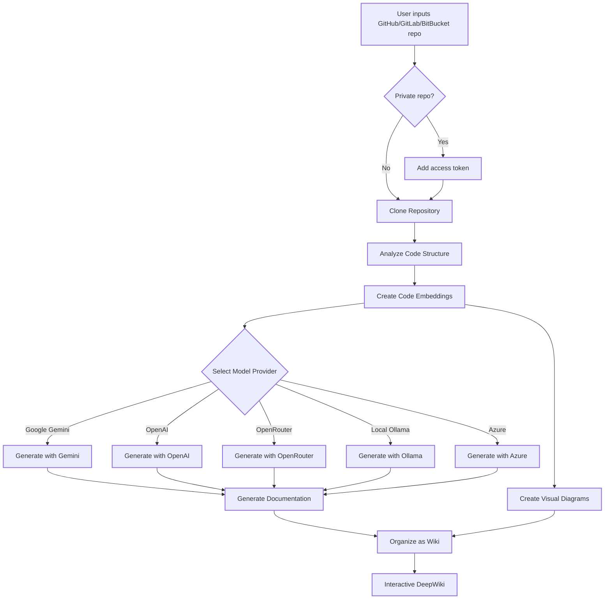

<Frame>

</Frame>

**DeepWiki-Open** is an innovative AI-powered documentation generator that automatically creates comprehensive, interactive wikis for any GitHub, GitLab, or BitBucket repository. Transform your codebase into beautiful, navigable documentation in seconds.

## What is DeepWiki-Open?

DeepWiki-Open analyzes your repository's code structure, understands the relationships between components, and generates:

<CardGroup cols={2}>
<Card title="Interactive Documentation" icon="book-open" href="/guides/wiki-generation">
  Comprehensive documentation with code analysis and explanations
</Card>

<Card title="Visual Diagrams" icon="diagram-project" href="/guides/mermaid-diagrams">
  Automatic Mermaid diagrams showing architecture and data flow
</Card>

<Card title="AI-Powered Chat" icon="comments" href="/guides/ask-feature">
  RAG-powered Q&A system to chat with your repository
</Card>

<Card title="Deep Research" icon="magnifying-glass" href="/guides/deep-research">
  Multi-turn AI research for complex code analysis
</Card>
</CardGroup>

## Key Features

### 🚀 Instant Documentation Generation
Simply enter a repository URL and DeepWiki will analyze the code structure, generate comprehensive documentation, and create visual diagrams to explain how everything works.

### 🔐 Private Repository Support
Securely access private repositories with personal access tokens from GitHub, GitLab, or BitBucket.

### 🤖 Multiple AI Model Providers
Choose from leading AI providers:
- **Google Gemini** (default: gemini-2.0-flash)
- **OpenAI** (gpt-4o, o1, o3, o4-mini)
- **OpenRouter** (access to Claude, Llama, Mistral, and more)
- **Azure OpenAI** (enterprise-grade deployment)
- **Ollama** (local open-source models)
- **Amazon Bedrock** (AWS-hosted models)
- **DashScope** (Alibaba Qwen models)

### 💬 Intelligent Q&A System
The **Ask Feature** uses Retrieval Augmented Generation (RAG) to provide accurate answers based on your repository's actual code.

### 🔍 Advanced Research Capabilities
**DeepResearch** conducts multi-turn investigations for complex topics, providing comprehensive analysis through multiple research iterations.

### 🌍 International Support
Built-in support for 10+ languages including English, Chinese, Japanese, Spanish, Korean, Vietnamese, Portuguese, French, and Russian.

## How It Works

<Steps>
<Step title="Repository Analysis">
  DeepWiki clones and analyzes your repository structure, including private repos with token authentication.
</Step>

<Step title="AI Processing">
  Creates embeddings of the code for smart retrieval and uses AI to generate documentation with context-aware understanding.
</Step>

<Step title="Visualization">
  Generates Mermaid diagrams to explain code relationships and system architecture.
</Step>

<Step title="Interactive Wiki">
  Organizes everything into a structured, navigable wiki with intelligent Q&A capabilities.
</Step>
</Steps>

## Architecture Overview



## Project Structure

The DeepWiki-Open project consists of:

<Tabs>
<Tab title="Frontend (Next.js)">
```
src/
├── app/                  # Next.js app directory
│   ├── page.tsx          # Main application page
│   └── api/              # API routes
├── components/           # React components
│   ├── Ask.tsx           # Q&A interface
│   ├── Mermaid.tsx       # Diagram renderer
│   └── ...
└── utils/               # Utility functions
```
</Tab>

<Tab title="Backend (Python)">
```
api/
├── main.py              # API entry point
├── api.py               # FastAPI implementation
├── rag.py               # RAG system
├── data_pipeline.py     # Data processing
├── config/              # Configuration files
│   ├── generator.json   # Model configurations
│   ├── embedder.json    # Embedding settings
│   └── repo.json        # Repository settings
└── requirements.txt     # Python dependencies
```
</Tab>
</Tabs>

## Quick Start

Ready to get started? Choose your preferred setup method:

<CardGroup cols={2}>
<Card title="Docker Setup (Recommended)" icon="docker" href="/getting-started/quick-start#docker-setup">
  Get up and running in minutes with Docker Compose
</Card>

<Card title="Manual Setup" icon="code" href="/getting-started/installation">
  Install and configure manually for development
</Card>
</CardGroup>

<Note>
You'll need API keys from your chosen AI provider (Google, OpenAI, etc.) to get started. See the [Environment Variables](/getting-started/environment-variables) guide for details.
</Note>

## Next Steps

<CardGroup cols={2}>
<Card title="Quick Start Guide" icon="rocket" href="/getting-started/quick-start">
  Get DeepWiki running in under 5 minutes
</Card>

<Card title="Configuration" icon="gear" href="/getting-started/model-providers">
  Configure your AI model providers
</Card>

<Card title="Features Guide" icon="star" href="/guides/wiki-generation">
  Learn about all DeepWiki features
</Card>

<Card title="API Reference" icon="code" href="/api/overview">
  Explore the REST API endpoints
</Card>
</CardGroup>