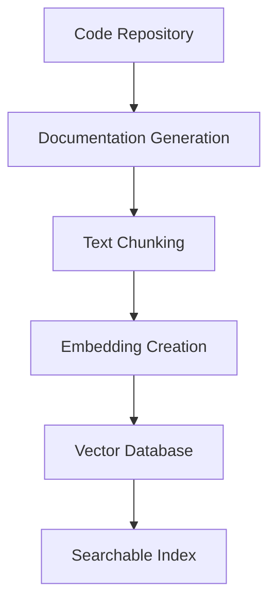

# Ask Feature Guide

The Ask feature is a powerful RAG (Retrieval Augmented Generation) system that enables natural language conversations with your code documentation. It combines advanced retrieval techniques with AI to provide accurate, contextual answers about your codebase.

## What is the Ask Feature?

The Ask feature transforms your static documentation into an interactive knowledge base where you can:

- **Ask natural questions** about your code, APIs, and documentation
- **Get contextual answers** with relevant code snippets and explanations
- **Maintain conversation history** for follow-up questions
- **Access real-time streaming responses** for immediate feedback
- **Query programmatically** via API for integration into other tools

<Card title="RAG Architecture" icon="brain">
  The Ask feature uses Retrieval Augmented Generation (RAG) to combine the best of both worlds: precise information retrieval from your docs with the natural language capabilities of large language models.
</Card>

## How RAG Works with Code

### 1. Document Indexing

When your wiki is generated, DeepWikiOpen creates semantic embeddings of your documentation:



### 2. Query Processing

When you ask a question, the system:

1. **Converts your question** into a semantic embedding
2. **Searches the vector database** for relevant documentation chunks
3. **Retrieves contextual information** from multiple sources
4. **Generates a comprehensive answer** using the retrieved context

<CodeGroup>

```typescript Query Processing Flow
// 1. Question embedding
const questionEmbedding = await embedQuery(userQuestion);

// 2. Similarity search
const relevantChunks = await vectorStore.similaritySearch(
  questionEmbedding,
  { k: 5, threshold: 0.7 }
);

// 3. Context preparation
const context = relevantChunks.map(chunk => ({
  content: chunk.content,
  source: chunk.metadata.source,
  score: chunk.score
}));

// 4. Response generation
const response = await generateResponse(userQuestion, context);
```

```python Python Example
# Vector similarity search
import numpy as np
from sentence_transformers import SentenceTransformer

model = SentenceTransformer('all-MiniLM-L6-v2')

def find_relevant_docs(question, doc_embeddings, docs, top_k=5):
    question_embedding = model.encode([question])
    
    # Calculate cosine similarity
    similarities = np.dot(question_embedding, doc_embeddings.T)
    top_indices = np.argsort(similarities[0])[-top_k:][::-1]
    
    return [docs[i] for i in top_indices]
```

</CodeGroup>

## Using the Ask Interface

### Basic Question Interface

The Ask feature provides an intuitive chat interface in your generated wiki:

<Frame>
  
</Frame>

### Conversation Flow

<Steps>
  <Step title="Ask Your Question">
    Type your question in natural language in the Ask input field
    ```
    How do I authenticate users in this API?
    ```
  </Step>
  
  <Step title="Real-time Processing">
    Watch as the system processes your query with streaming responses
    ```
    Searching documentation... ⚡
    Found 3 relevant sections... 📚
    Generating response... 🤖
    ```
  </Step>
  
  <Step title="Receive Answer">
    Get a comprehensive answer with code examples and source references
  </Step>
  
  <Step title="Follow-up Questions">
    Continue the conversation with contextual follow-up queries
  </Step>
</Steps>

## Types of Questions That Work Best

### ✅ Excellent Question Types

<CardGroup cols={2}>
  <Card title="How-To Questions" icon="lightbulb">
    **Examples:**
    - "How do I set up authentication?"
    - "How to handle errors in the API?"
    - "How do I deploy this application?"
  </Card>
  
  <Card title="What-Is Questions" icon="question">
    **Examples:**
    - "What is the UserService class?"
    - "What does the config.json file contain?"
    - "What are the available endpoints?"
  </Card>
  
  <Card title="Code Location Questions" icon="map-pin">
    **Examples:**
    - "Where is the database connection configured?"
    - "Where are the API routes defined?"
    - "Which file contains the main application logic?"
  </Card>
  
  <Card title="Best Practice Questions" icon="star">
    **Examples:**
    - "What's the recommended way to handle validation?"
    - "Best practices for error handling?"
    - "How should I structure my tests?"
  </Card>
</CardGroup>

### ❌ Less Effective Question Types

<Warning>
  These types of questions may not yield optimal results:
  - Vague questions without context ("How does this work?")
  - Questions about code not in your documentation
  - Highly specific implementation details not documented
  - Questions requiring real-time data or external information
</Warning>

## Example Questions and Responses

### API Documentation Questions

<Tabs>
  <Tab title="Question">
    **User:** "How do I authenticate requests to the API?"
  </Tab>
  
  <Tab title="Response">
    **AI:** Based on your API documentation, authentication is handled using JWT tokens. Here's how to authenticate requests:

    ## Authentication Method

    ```typescript
    // Include the JWT token in the Authorization header
    const response = await fetch('/api/users', {
      headers: {
        'Authorization': `Bearer ${jwtToken}`,
        'Content-Type': 'application/json'
      }
    });
    ```

    ## Getting a Token

    First, authenticate with your credentials:

    ```typescript
    const authResponse = await fetch('/api/auth/login', {
      method: 'POST',
      headers: { 'Content-Type': 'application/json' },
      body: JSON.stringify({
        email: 'user@example.com',
        password: 'yourpassword'
      })
    });

    const { token } = await authResponse.json();
    ```

    **Sources:** 
    - `/docs/api/authentication.md`
    - `/examples/auth-example.js`
  </Tab>
</Tabs>

### Code Structure Questions

<Tabs>
  <Tab title="Question">
    **User:** "What's the structure of the database models?"
  </Tab>
  
  <Tab title="Response">
    **AI:** Your application uses several database models organized in the `/models` directory:

    ## Core Models

    ```typescript
    // User Model
    interface User {
      id: string;
      email: string;
      name: string;
      createdAt: Date;
      updatedAt: Date;
    }

    // Project Model  
    interface Project {
      id: string;
      title: string;
      description: string;
      ownerId: string;
      members: string[];
    }
    ```

    ## Model Relationships

    ```mermaid
    graph TD
        A[User] -->|owns| B[Project]
        A -->|member of| B
        B -->|contains| C[Task]
        C -->|assigned to| A
    ```

    **Sources:**
    - `/models/User.ts`
    - `/models/Project.ts` 
    - `/docs/database-schema.md`
  </Tab>
</Tabs>

## Conversation History and Context

### Context Retention

The Ask feature maintains conversation context throughout your session:

```typescript
// Example conversation flow
const conversation = [
  {
    role: 'user',
    content: 'How do I set up the database?',
    timestamp: '2024-01-15T10:00:00Z'
  },
  {
    role: 'assistant', 
    content: 'To set up the database, you need to...',
    sources: ['/docs/setup.md', '/config/database.js'],
    timestamp: '2024-01-15T10:00:05Z'
  },
  {
    role: 'user',
    content: 'What about migrations?', // Context: Still about database setup
    timestamp: '2024-01-15T10:02:00Z'
  }
];
```

### Follow-up Question Examples

<AccordionGroup>
  <Accordion title="Initial Question: API Endpoints">
    **Q:** "What API endpoints are available?"
    
    **A:** Lists all available endpoints with descriptions...
    
    **Follow-up:** "How do I use the user endpoint?"
    **Follow-up:** "What's the rate limiting for these endpoints?"
    **Follow-up:** "Are there any authentication requirements?"
  </Accordion>
  
  <Accordion title="Initial Question: Error Handling">
    **Q:** "How does error handling work?"
    
    **A:** Explains the error handling strategy with examples...
    
    **Follow-up:** "What about async errors?"
    **Follow-up:** "How do I log these errors?"
    **Follow-up:** "Are there custom error types?"
  </Accordion>
</AccordionGroup>

## Streaming Responses and Real-time Interaction

### Streaming Implementation

The Ask feature provides real-time streaming responses for immediate feedback:

<CodeGroup>

```typescript Client-Side Streaming
const askQuestion = async (question: string) => {
  const response = await fetch('/api/ask', {
    method: 'POST',
    headers: { 'Content-Type': 'application/json' },
    body: JSON.stringify({ question })
  });

  const reader = response.body?.getReader();
  const decoder = new TextDecoder();

  while (true) {
    const { done, value } = await reader.read();
    if (done) break;
    
    const chunk = decoder.decode(value);
    const lines = chunk.split('\n');
    
    for (const line of lines) {
      if (line.startsWith('data: ')) {
        const data = JSON.parse(line.slice(6));
        updateUI(data); // Real-time UI updates
      }
    }
  }
};
```

```python Server-Side Streaming
from fastapi import FastAPI
from fastapi.responses import StreamingResponse
import json

app = FastAPI()

@app.post("/api/ask")
async def ask_question(question: dict):
    def generate_response():
        # Search for relevant documents
        yield f"data: {json.dumps({'type': 'status', 'message': 'Searching...'})}\n\n"
        
        relevant_docs = search_documents(question['question'])
        yield f"data: {json.dumps({'type': 'status', 'message': f'Found {len(relevant_docs)} relevant sections'})}\n\n"
        
        # Generate streaming response
        for chunk in generate_answer(question['question'], relevant_docs):
            yield f"data: {json.dumps({'type': 'content', 'chunk': chunk})}\n\n"
        
        yield f"data: {json.dumps({'type': 'complete'})}\n\n"
    
    return StreamingResponse(generate_response(), media_type="text/plain")
```

</CodeGroup>

### Visual Feedback

<Frame>
  
</Frame>

The interface provides visual indicators for:
- **Search progress** with animated loading states
- **Token-by-token streaming** for real-time response building  
- **Source highlighting** as references are found
- **Completion status** when the response is finished

## API Usage for Programmatic Q&A

### REST API Endpoints

<CodeGroup>

```bash cURL Example
curl -X POST "https://your-wiki.com/api/ask" \
  -H "Content-Type: application/json" \
  -H "Authorization: Bearer YOUR_API_KEY" \
  -d '{
    "question": "How do I implement user authentication?",
    "conversation_id": "conv_123",
    "include_sources": true,
    "stream": false
  }'
```

```javascript JavaScript SDK
import { DeepWikiClient } from '@deepwiki/client';

const client = new DeepWikiClient({
  apiKey: 'your-api-key',
  baseUrl: 'https://your-wiki.com'
});

// Simple question
const response = await client.ask({
  question: "How do I set up the development environment?",
  includeSource: true
});

console.log(response.answer);
console.log(response.sources);

// Streaming question
const stream = client.askStreaming({
  question: "Explain the authentication flow",
  conversationId: "conv_123"
});

for await (const chunk of stream) {
  if (chunk.type === 'content') {
    process.stdout.write(chunk.text);
  }
}
```

```python Python SDK
from deepwiki import DeepWikiClient

client = DeepWikiClient(
    api_key="your-api-key",
    base_url="https://your-wiki.com"
)

# Synchronous question
response = client.ask(
    question="What are the available API endpoints?",
    include_sources=True
)

print(response.answer)
for source in response.sources:
    print(f"Source: {source.file} (Score: {source.relevance_score})")

# Asynchronous streaming
async for chunk in client.ask_streaming(
    question="How does error handling work?",
    conversation_id="conv_456"
):
    if chunk.type == "content":
        print(chunk.text, end="", flush=True)
```

</CodeGroup>

### API Response Format

```json
{
  "id": "ask_123456789",
  "question": "How do I authenticate users?",
  "answer": "To authenticate users in this API, you use JWT tokens...",
  "sources": [
    {
      "file": "/docs/authentication.md",
      "title": "Authentication Guide", 
      "relevance_score": 0.95,
      "excerpt": "JWT tokens are used for authentication..."
    },
    {
      "file": "/examples/auth.js",
      "title": "Authentication Example",
      "relevance_score": 0.87,
      "excerpt": "const token = jwt.sign(payload, secret);"
    }
  ],
  "conversation_id": "conv_123",
  "timestamp": "2024-01-15T10:30:00Z",
  "processing_time_ms": 1250
}
```

## Best Practices for Effective Questions

### 🎯 Writing Better Questions

<CardGroup cols={2}>
  <Card title="Be Specific" icon="target">
    **Instead of:** "How does this work?"
    
    **Try:** "How does user authentication work in the login endpoint?"
  </Card>
  
  <Card title="Provide Context" icon="info">
    **Instead of:** "Fix this error"
    
    **Try:** "How do I handle the 'Database connection failed' error when starting the server?"
  </Card>
  
  <Card title="Ask About Documented Features" icon="book">
    **Good:** "What configuration options are available for the email service?"
    
    **Less Good:** "How do I integrate with an undocumented third-party service?"
  </Card>
  
  <Card title="Use Examples" icon="code">
    **Better:** "How do I format a POST request to create a new user with email and password fields?"
    
    **vs:** "How do I create users?"
  </Card>
</CardGroup>

### 📝 Question Templates

<Tabs>
  <Tab title="How-To Template">
    ```
    How do I [specific action] in [specific context]?
    
    Examples:
    - How do I configure Redis caching in the production environment?
    - How do I validate user input in the registration form?
    - How do I set up database migrations for the User model?
    ```
  </Tab>
  
  <Tab title="What-Is Template">
    ```
    What is [specific component/concept] and how does it [function/relate]?
    
    Examples:
    - What is the AuthMiddleware class and how does it validate tokens?
    - What is the config.database object and how does it connect to PostgreSQL?
    - What is the UserService and how does it interact with the database?
    ```
  </Tab>
  
  <Tab title="Where-Find Template">
    ```
    Where can I find [specific functionality/configuration] for [context]?
    
    Examples:
    - Where can I find the API rate limiting configuration?
    - Where are the email templates stored for password reset?
    - Where is the logging configuration for production deployment?
    ```
  </Tab>
  
  <Tab title="Best-Practice Template">
    ```
    What's the recommended way to [specific task] in this codebase?
    
    Examples:
    - What's the recommended way to handle async errors in API endpoints?
    - What's the recommended way to structure test files for components?
    - What's the recommended way to manage environment variables?
    ```
  </Tab>
</Tabs>

### 💡 Advanced Query Techniques

<AccordionGroup>
  <Accordion title="Multi-part Questions">
    Break complex questions into parts:
    
    **Instead of:** "How do I set up the database, configure authentication, and deploy to production?"
    
    **Try:**
    1. "How do I set up the database for development?"
    2. "How do I configure JWT authentication?" (follow-up)
    3. "What's the deployment process for production?" (follow-up)
  </Accordion>
  
  <Accordion title="Reference Previous Context">
    Build on previous answers:
    
    **After asking about authentication:**
    - "How do I test these authentication endpoints?"
    - "What error codes does this authentication return?"
    - "How do I refresh expired tokens mentioned earlier?"
  </Accordion>
  
  <Accordion title="Ask for Examples">
    Request concrete examples:
    
    **Good questions:**
    - "Can you show me an example of making a POST request to create a user?"
    - "What does a typical error response look like?"
    - "Can you provide a sample configuration file?"
  </Accordion>
</AccordionGroup>

## Limitations and Troubleshooting

### Known Limitations

<Warning>
  **Current limitations of the Ask feature:**
  
  - **Documentation Scope**: Only searches indexed documentation and code files
  - **Real-time Data**: Cannot access live databases or external APIs
  - **Code Execution**: Cannot run or test code, only explain existing code
  - **Version Specificity**: May not distinguish between different versions of your code
  - **Complex Logic**: May struggle with highly complex business logic without clear documentation
</Warning>

### Common Issues and Solutions

<AccordionGroup>
  <Accordion title="No Relevant Results Found">
    **Symptoms:** The AI responds with "I couldn't find relevant information"
    
    **Solutions:**
    - Check if your question relates to documented features
    - Try rephrasing with different terminology
    - Ensure your documentation was properly indexed
    - Ask more specific questions about documented components
    
    **Example Fix:**
    - ❌ "How do I use advanced features?"
    - ✅ "How do I configure the email notification system?"
  </Accordion>
  
  <Accordion title="Inaccurate or Incomplete Answers">
    **Symptoms:** The response doesn't match your actual codebase
    
    **Solutions:**
    - Verify your documentation is up-to-date
    - Re-index your documentation if you've made recent changes
    - Provide more context in your question
    - Ask follow-up questions for clarification
    
    **Example:**
    ```
    Q: "The authentication process you described doesn't match my code"
    Follow-up: "Can you show me specifically how JWT tokens are validated in the middleware?"
    ```
  </Accordion>
  
  <Accordion title="Slow Response Times">
    **Symptoms:** Questions take a long time to process
    
    **Solutions:**
    - Check if you're asking very broad questions (try being more specific)
    - Verify your internet connection for streaming responses
    - Consider if your documentation is very large (may require longer processing)
    - Use the API with appropriate timeout settings
    
    **Optimization:**
    ```javascript
    // Set appropriate timeouts for API calls
    const response = await client.ask({
      question: "How do I configure logging?",
      timeout: 30000 // 30 seconds
    });
    ```
  </Accordion>
  
  <Accordion title="Context Not Maintained">
    **Symptoms:** Follow-up questions don't reference previous conversation
    
    **Solutions:**
    - Ensure you're using the same conversation session
    - Check that cookies/session storage is enabled
    - For API usage, pass the same `conversation_id`
    - Start a new conversation if context becomes confusing
    
    **API Example:**
    ```javascript
    // Maintain conversation context
    const conversationId = 'conv_' + Date.now();
    
    const response1 = await client.ask({
      question: "How do I set up authentication?",
      conversationId
    });
    
    const response2 = await client.ask({
      question: "What about authorization for these endpoints?",
      conversationId // Same ID maintains context
    });
    ```
  </Accordion>
</AccordionGroup>

### Performance Optimization Tips

<Tabs>
  <Tab title="Question Optimization">
    **Optimize your questions for better performance:**
    
    ```markdown
    ✅ Good Performance:
    - Specific questions about documented features
    - Questions referencing specific file names or classes
    - Well-structured questions with clear context
    
    ❌ Poor Performance:  
    - Extremely broad questions requiring full codebase analysis
    - Questions about undocumented or external dependencies
    - Vague questions without specific context
    ```
  </Tab>
  
  <Tab title="API Usage">
    **Optimize API calls:**
    
    ```javascript
    // Use appropriate parameters
    const response = await client.ask({
      question: "How do I configure the database?",
      maxSources: 3,        // Limit sources for faster processing
      includeSourceText: false, // Skip full source text if not needed
      stream: true          // Use streaming for better perceived performance
    });
    ```
  </Tab>
  
  <Tab title="Conversation Management">
    **Manage conversations efficiently:**
    
    ```javascript
    // Clear conversation context when changing topics
    if (isNewTopic(question)) {
      conversationId = generateNewConversationId();
    }
    
    // Archive old conversations to improve performance
    if (conversationAge > MAX_CONVERSATION_AGE) {
      await client.archiveConversation(conversationId);
      conversationId = generateNewConversationId();
    }
    ```
  </Tab>
</Tabs>

### Debug Mode

Enable debug mode to troubleshoot issues:

<CodeGroup>

```javascript Client Debug
const client = new DeepWikiClient({
  apiKey: 'your-api-key',
  debug: true  // Enables detailed logging
});

const response = await client.ask({
  question: "How does caching work?",
  debug: true  // Request debug information
});

console.log('Debug Info:', response.debug);
// Shows: query processing time, sources found, embedding similarity scores
```

```python Python Debug
client = DeepWikiClient(
    api_key="your-api-key",
    debug=True
)

response = client.ask(
    question="How does error handling work?",
    debug=True
)

print("Sources found:", len(response.sources))
print("Processing time:", response.processing_time_ms)
print("Query embedding dimensions:", response.debug.embedding_dimensions)
```

</CodeGroup>

---

<Card title="Need Help?" icon="support">
  **Still having issues?**
  
  - Check the [API Documentation](/api-reference) for detailed endpoint information
  - Review [Common Patterns](/guides/common-patterns) for question examples
  - Contact support with specific error messages and question examples
  - Join our community Discord for real-time help
</Card>

## Next Steps

<CardGroup cols={2}>
  <Card title="API Reference" icon="code" href="/api-reference/ask">
    Detailed API documentation for programmatic access
  </Card>
  
  <Card title="Integration Guide" icon="plug" href="/guides/integration">
    Learn how to integrate Ask into your applications
  </Card>
  
  <Card title="Advanced Features" icon="stars" href="/guides/advanced-features">
    Explore advanced Ask feature capabilities
  </Card>
  
  <Card title="Best Practices" icon="lightbulb" href="/guides/best-practices">
    Tips and patterns for effective documentation Q&A
  </Card>
</CardGroup>