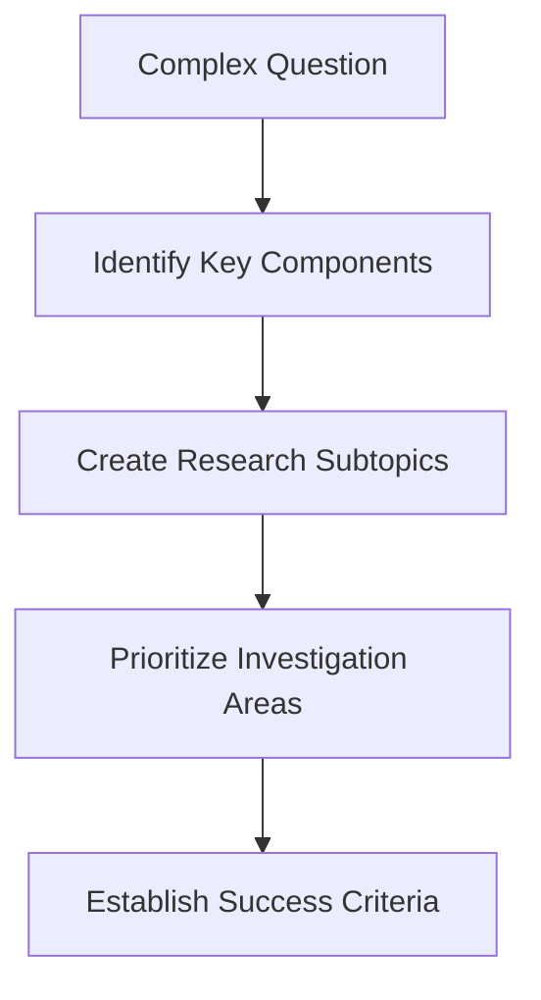
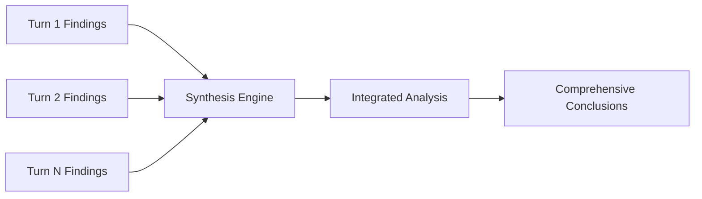
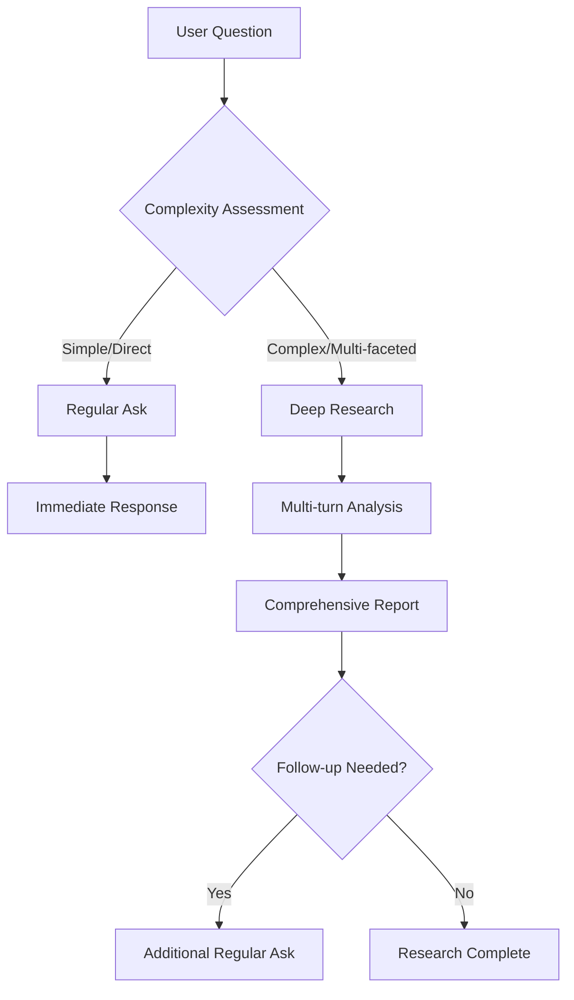

# Deep Research Guide

Deep Research is DeepWikiOpen's advanced multi-turn analysis feature that enables comprehensive investigation of complex topics through iterative AI-powered research cycles.

## What is Deep Research?

Deep Research is an intelligent research methodology that breaks down complex questions into manageable components, conducting thorough analysis through multiple iterative turns. Unlike traditional single-response queries, Deep Research employs a systematic approach:

1. **Planning Phase**: AI analyzes the question and creates a structured research plan
2. **Execution Phase**: Multiple research turns explore different aspects
3. **Synthesis Phase**: Findings are consolidated into comprehensive conclusions

### Core Components

- **Multi-turn Analysis**: Sequential research iterations building on previous findings
- **Adaptive Planning**: Research direction adjusts based on discovered information
- **Source Integration**: Combines multiple authoritative sources
- **Progressive Refinement**: Each turn deepens understanding and fills knowledge gaps

## Deep Research vs Regular Ask

| Feature | Regular Ask | Deep Research |
|---------|-------------|---------------|
| **Scope** | Single focused question | Complex, multi-faceted topics |
| **Process** | One-turn response | Multi-turn iterative analysis |
| **Depth** | Surface-level or specific facts | Comprehensive investigation |
| **Sources** | Limited source consultation | Extensive source integration |
| **Time** | Immediate response | Extended research process |
| **Complexity** | Simple to moderate | High complexity topics |

### When to Use Deep Research

**Choose Deep Research for:**
- Complex historical events with multiple perspectives
- Scientific topics requiring interdisciplinary analysis
- Market research spanning multiple industries
- Policy analysis with various stakeholder viewpoints
- Technical investigations requiring multiple sources
- Comparative studies across different domains

**Choose Regular Ask for:**
- Quick fact checks
- Simple definitions
- Specific date/number queries
- Direct procedural questions
- Basic how-to inquiries

## The Deep Research Process

### 1. Research Planning

The AI begins by analyzing your question and creating a structured research plan:

```json
{
  "research_question": "How has climate change affected global food security?",
  "research_plan": [
    "Analyze climate change impacts on agriculture",
    "Examine regional variations in food production",
    "Investigate supply chain disruptions",
    "Study adaptation strategies and technologies",
    "Evaluate policy responses and effectiveness"
  ],
  "estimated_turns": 4-6,
  "key_sources": ["IPCC reports", "FAO data", "agricultural journals"]
}
```

### 2. Iterative Research Turns

Each research turn focuses on specific aspects:

**Turn 1: Foundation Building**
- Establish core concepts and definitions
- Identify primary data sources
- Map the research landscape

**Turn 2-N: Deep Dive Analysis**
- Explore specific subtopics
- Gather supporting evidence
- Identify patterns and connections

**Final Turn: Synthesis**
- Integrate findings across all turns
- Draw comprehensive conclusions
- Highlight limitations and future research needs

### 3. Progress Updates

Throughout the process, you receive real-time updates:

```
🔍 Research Progress: Turn 2/5
📊 Sources analyzed: 23
🎯 Current focus: Regional climate impacts on crop yields
⏱️ Estimated completion: 3-4 minutes
```

## Types of Questions Suitable for Deep Research

### Scientific & Technical Topics

**Example**: "What are the latest developments in quantum computing and their potential applications?"

**Research Approach**:
- Current quantum computing technologies
- Recent breakthroughs and publications
- Industry applications and use cases
- Challenges and limitations
- Future prospects and timeline

### Historical Analysis

**Example**: "How did the Silk Road influence cultural exchange between East and West?"

**Research Approach**:
- Historical context and timeline
- Trade routes and major cities
- Cultural, religious, and technological exchanges
- Economic impacts on civilizations
- Long-term historical significance

### Policy & Social Issues

**Example**: "What are the effects of universal basic income pilot programs worldwide?"

**Research Approach**:
- UBI pilot program overview
- Implementation models across countries
- Economic outcomes and metrics
- Social and behavioral impacts
- Policy implications and scalability

### Business & Market Analysis

**Example**: "How is artificial intelligence transforming the healthcare industry?"

**Research Approach**:
- AI applications in healthcare sectors
- Market size and growth projections
- Key players and technologies
- Regulatory challenges and compliance
- Patient outcomes and case studies

## Research Stages and Iteration Process

### Stage 1: Question Decomposition



### Stage 2: Information Gathering

Each turn systematically explores different aspects:

1. **Primary Source Analysis**: Academic papers, official reports, government data
2. **Cross-referencing**: Validating information across multiple sources
3. **Trend Identification**: Recognizing patterns and emerging themes
4. **Gap Analysis**: Identifying areas needing additional investigation

### Stage 3: Synthesis and Conclusions



## Example Deep Research Session

### Question: "How has remote work adoption changed business operations post-pandemic?"

#### Research Plan
```
📋 Research Plan (5 turns estimated)
1. Pre-pandemic vs current remote work statistics
2. Technology infrastructure adaptations
3. Management and productivity impacts
4. Employee experience and workplace culture
5. Long-term business strategy changes
```

#### Turn 1: Statistical Foundation
```
🔍 Turn 1/5: Baseline Statistics
📊 Key Findings:
- Remote work adoption increased from 24% (2019) to 71% (2023)
- Hybrid models now represent 49% of work arrangements
- Technology spending on collaboration tools up 300%

📚 Sources: Bureau of Labor Statistics, McKinsey Global Institute, Gartner
⏱️ Next: Technology infrastructure analysis
```

#### Turn 2: Technology Infrastructure
```
🔍 Turn 2/5: Technology Adaptations
🛠️ Key Findings:
- Cloud infrastructure adoption accelerated by 3-5 years
- Cybersecurity spending increased 40% for remote access
- Video conferencing usage up 2000% since 2020

💡 Emerging Trend: AI-powered productivity tools gaining adoption
⏱️ Next: Management impact analysis
```

#### Turn 3: Management Evolution
```
🔍 Turn 3/5: Management & Productivity
📈 Key Findings:
- 67% of managers report improved productivity metrics
- Performance evaluation shifted to outcome-based models
- Middle management roles evolved toward coaching

⚠️ Challenge: Maintaining team cohesion and company culture
⏱️ Next: Employee experience deep dive
```

#### Turn 4: Employee Experience
```
🔍 Turn 4/5: Employee Perspectives
👥 Key Findings:
- 87% prefer hybrid/remote work options
- Work-life balance improved for 74% of workers
- Career development concerns increased 23%

🔄 Adaptation: New onboarding and mentorship programs
⏱️ Next: Strategic business implications
```

#### Turn 5: Strategic Business Changes
```
🔍 Turn 5/5: Long-term Strategy Impact
🏢 Key Findings:
- Office space reduction: average 30% smaller footprint
- Geographic talent acquisition expanded 340%
- Cost savings average $11K per remote employee annually

🎯 Strategic Shift: From location-based to talent-based hiring
⏱️ Finalizing comprehensive analysis...
```

#### Final Synthesis
```
📋 COMPREHENSIVE ANALYSIS: Remote Work Business Transformation

🔍 EXECUTIVE SUMMARY
The pandemic-driven shift to remote work has fundamentally transformed business operations, 
creating a permanent change in workplace dynamics with significant strategic implications.

📊 KEY TRANSFORMATIONS
1. Operational Model: Hybrid-first approach now standard (71% adoption)
2. Technology Infrastructure: Accelerated digital transformation ($2.3T investment)
3. Management Philosophy: Outcome-based performance evaluation
4. Talent Strategy: Geographic boundaries eliminated for recruitment
5. Cost Structure: Average 20-30% reduction in operational expenses

🎯 STRATEGIC IMPLICATIONS
- Companies maintaining remote flexibility report 25% better talent retention
- Productivity gains sustained at 13-50% above pre-pandemic levels
- New competitive advantages through expanded talent pools
- Risk mitigation through distributed workforce models

⚠️ ONGOING CHALLENGES
- Maintaining organizational culture and team cohesion
- Ensuring equitable career development opportunities
- Managing cybersecurity in distributed environments
- Balancing flexibility with collaboration needs

🔮 FUTURE OUTLOOK
The remote work transformation appears permanent, with 83% of companies 
planning long-term hybrid models. Success factors include:
- Investment in collaborative technologies
- Adaptive management training
- Culture-building initiatives
- Flexible policy frameworks

📚 Research based on 47 sources including McKinsey, Deloitte, Harvard Business Review,
and primary data from Fortune 500 companies.
```

## API Usage for Automated Research

### Basic Deep Research Request

```python
import requests

# Start deep research session
response = requests.post('https://api.deepwikiopen.com/v1/deep-research', {
    'question': 'How is blockchain technology affecting supply chain management?',
    'max_turns': 6,
    'focus_areas': ['technology', 'case_studies', 'challenges', 'future_trends'],
    'source_preferences': ['academic', 'industry_reports', 'case_studies']
})

research_id = response.json()['research_id']
```

### Monitor Research Progress

```python
# Check research status
status_response = requests.get(f'https://api.deepwikiopen.com/v1/deep-research/{research_id}/status')
progress = status_response.json()

print(f"Progress: {progress['current_turn']}/{progress['total_turns']}")
print(f"Current focus: {progress['current_focus']}")
print(f"Sources analyzed: {progress['sources_count']}")
```

### Retrieve Results

```python
# Get final results
results_response = requests.get(f'https://api.deepwikiopen.com/v1/deep-research/{research_id}/results')
research_data = results_response.json()

# Access structured findings
for turn in research_data['turns']:
    print(f"Turn {turn['number']}: {turn['focus']}")
    print(f"Key findings: {turn['key_findings']}")
    print(f"Sources: {len(turn['sources'])}")

# Get final synthesis
synthesis = research_data['synthesis']
print(f"Comprehensive analysis: {synthesis['executive_summary']}")
```

### Advanced API Configuration

```python
# Advanced research configuration
advanced_config = {
    'question': 'Impact of AI on financial services',
    'research_parameters': {
        'depth_level': 'comprehensive',  # standard, comprehensive, exhaustive
        'time_constraint': '15_minutes',
        'source_diversity': 'high',
        'regional_focus': ['north_america', 'europe', 'asia'],
        'time_range': '2020-2024',
        'confidence_threshold': 0.8
    },
    'output_preferences': {
        'include_citations': True,
        'visual_elements': ['charts', 'timelines'],
        'summary_length': 'detailed',
        'technical_level': 'expert'
    }
}
```

## Performance Considerations

### Research Duration

| Question Complexity | Typical Turns | Duration | Sources |
|-------------------|---------------|----------|---------|
| **Simple** | 2-3 turns | 2-4 minutes | 10-20 |
| **Moderate** | 3-5 turns | 5-8 minutes | 25-50 |
| **Complex** | 5-8 turns | 8-15 minutes | 50-100+ |
| **Exhaustive** | 8-12 turns | 15-25 minutes | 100-200+ |

### Optimization Strategies

**For Faster Results:**
- Use focused question framing
- Specify known time constraints
- Limit source types if appropriate
- Set explicit scope boundaries

**For Deeper Analysis:**
- Allow flexible turn limits
- Include interdisciplinary sources
- Enable follow-up question generation
- Request comprehensive citations

### Resource Usage

```python
# Monitor token consumption
research_stats = {
    'input_tokens': 2500,      # Question + context
    'processing_tokens': 45000, # Multi-turn analysis
    'output_tokens': 8000,     # Final synthesis
    'total_cost': '$0.32'      # Estimated API cost
}
```

## Best Practices and Optimization Tips

### Question Formulation

**✅ Effective Deep Research Questions:**
- "How has cryptocurrency regulation evolved globally and what are the implications for adoption?"
- "What are the environmental and economic impacts of vertical farming technologies?"
- "How do different countries approach data privacy legislation and enforcement?"

**❌ Less Suitable for Deep Research:**
- "What is the capital of France?" (too simple)
- "How do I change a tire?" (procedural, not analytical)
- "What's the weather today?" (current, specific data)

### Scope Management

```markdown
## Research Scope Framework

### 🎯 Well-Scoped Questions
- Clear temporal boundaries (e.g., "since 2020", "in the next decade")
- Defined geographic focus (e.g., "in developed nations", "across Asia-Pacific")
- Specific industry/domain (e.g., "in healthcare", "for SMB companies")
- Measurable aspects (e.g., "economic impact", "user adoption rates")

### ⚠️ Overly Broad Questions
- "How does technology affect society?" → Too general
- "What is the future of business?" → Too vague
- "How does everything connect?" → No clear scope
```

### Source Quality Optimization

**High-Quality Source Preferences:**
- Peer-reviewed academic papers
- Government and institutional reports
- Industry analysis from recognized firms
- Primary research and surveys
- Expert interviews and case studies

**Source Validation Indicators:**
- Author credentials and affiliations
- Publication date and relevance
- Citation count and impact factor
- Methodology transparency
- Cross-reference validation

### Iterative Refinement

```python
# Example of research refinement workflow
refinement_process = {
    'initial_question': 'How is AI changing education?',
    'refined_questions': [
        'How is AI being implemented in K-12 education systems?',
        'What are the learning outcomes of AI-powered educational tools?',
        'How do educators perceive AI integration in classrooms?',
        'What are the equity implications of AI in education?'
    ],
    'focus_areas': [
        'implementation_models',
        'effectiveness_metrics',
        'teacher_training',
        'accessibility_concerns'
    ]
}
```

### Quality Assurance

**Research Quality Metrics:**
- **Source Diversity**: Multiple perspectives and methodologies
- **Temporal Coverage**: Recent and historical context
- **Evidence Strength**: Primary data and expert consensus
- **Bias Mitigation**: Balanced viewpoint representation
- **Completeness**: Addressing all aspects of the question

### Common Pitfalls to Avoid

1. **Question Too Narrow**: Results in shallow, limited analysis
2. **Unrealistic Time Expectations**: Complex topics need adequate research time
3. **Source Bias**: Over-relying on single source types or viewpoints
4. **Scope Creep**: Allowing research to expand beyond useful boundaries
5. **Insufficient Context**: Not providing relevant background information

### Integration with Regular Ask



## Advanced Features

### Real-time Research Updates

Enable live progress tracking:

```javascript
// WebSocket connection for real-time updates
const ws = new WebSocket('wss://api.deepwikiopen.com/v1/research-stream');

ws.onmessage = function(event) {
    const update = JSON.parse(event.data);
    console.log(`Turn ${update.turn}: ${update.status}`);
    console.log(`Sources analyzed: ${update.sources_count}`);
    console.log(`Current focus: ${update.current_focus}`);
};
```

### Collaborative Research

Multiple researchers can contribute to the same deep research session:

```python
# Add collaborative researchers
collaboration_config = {
    'research_id': research_id,
    'collaborators': [
        {'role': 'domain_expert', 'focus': 'technical_analysis'},
        {'role': 'market_analyst', 'focus': 'commercial_implications'},
        {'role': 'policy_expert', 'focus': 'regulatory_landscape'}
    ],
    'coordination_mode': 'parallel_with_synthesis'
}
```

### Research Templates

Use pre-configured research templates for common analysis types:

```python
# Market analysis template
market_template = {
    'template_id': 'market_analysis_v2',
    'standard_turns': [
        'market_size_and_trends',
        'competitive_landscape',
        'customer_segments',
        'regulatory_environment',
        'future_projections'
    ],
    'required_sources': ['industry_reports', 'financial_data', 'market_surveys'],
    'output_format': 'executive_summary_with_appendices'
}
```

## Conclusion

Deep Research represents a paradigm shift in AI-powered information analysis, enabling comprehensive investigation of complex topics through systematic, iterative research processes. By understanding when and how to leverage this powerful feature, users can obtain insights that go far beyond traditional search and single-turn AI responses.

The key to successful deep research lies in proper question formulation, appropriate scope management, and leveraging the full potential of multi-turn analysis. As AI capabilities continue to evolve, Deep Research will become an increasingly valuable tool for researchers, analysts, and decision-makers across all industries.

---

*For more information about DeepWikiOpen's Deep Research capabilities, visit our [API documentation](/api/deep-research) or explore our [example research sessions](/examples/deep-research).*