# Mermaid Diagrams in DeepWiki

DeepWiki leverages the power of Mermaid to automatically generate beautiful, interactive diagrams from your codebase and documentation. This guide covers everything you need to know about working with Mermaid diagrams in DeepWiki.

## What are Mermaid Diagrams?

Mermaid is a JavaScript-based diagramming tool that renders markdown-inspired text definitions to create diagrams dynamically. In DeepWiki, these diagrams help visualize:

- Code architecture and relationships
- Data flow and process workflows  
- System interactions and dependencies
- Database schemas and entity relationships
- Project timelines and milestones

### Benefits of Mermaid Diagrams

- **Version Control Friendly**: Text-based definitions that work with Git
- **Automatically Generated**: DeepWiki creates diagrams from your code structure
- **Interactive**: Zoom, pan, and click functionality
- **Customizable**: Extensive styling and theming options
- **Lightweight**: No external image files needed
- **Accessible**: Screen reader compatible with proper markup

## Types of Diagrams Generated

DeepWiki automatically generates various diagram types based on your codebase analysis:

### 1. Flowcharts

Perfect for visualizing code logic, decision trees, and process flows.

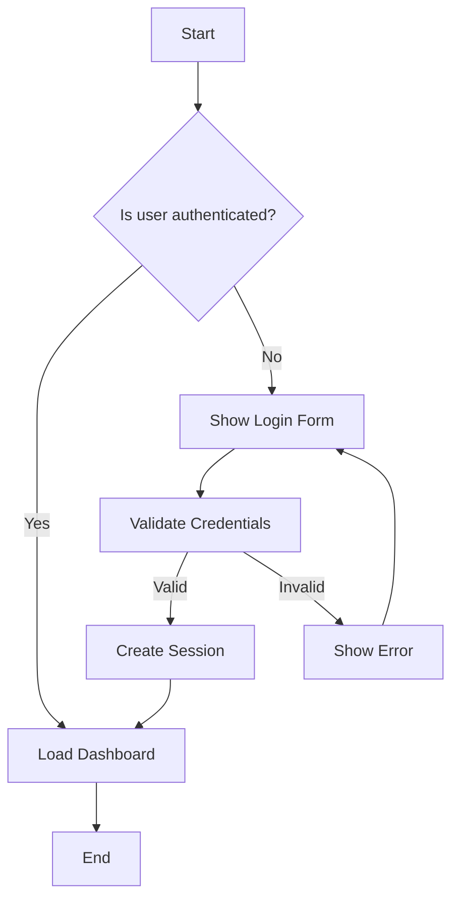

### 2. Sequence Diagrams

Ideal for API interactions, user flows, and system communications.

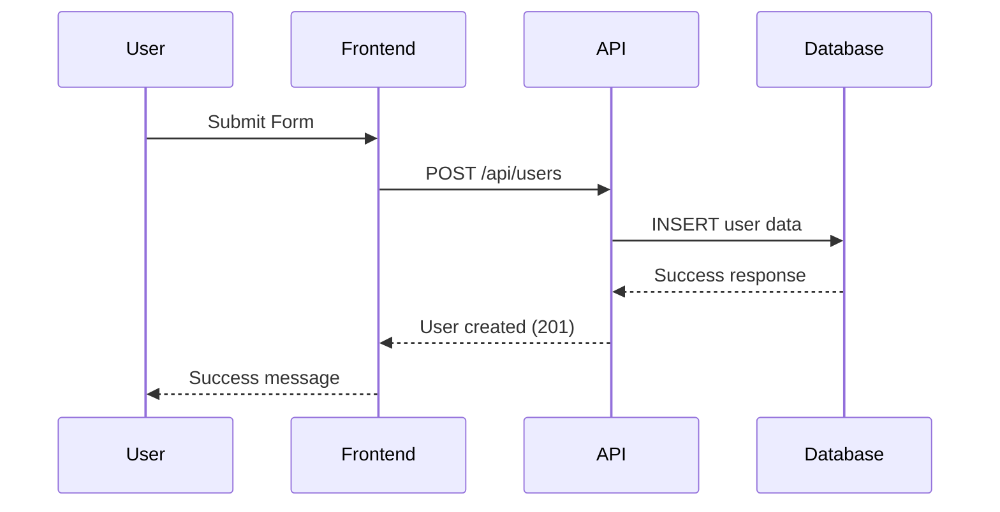

### 3. Class Diagrams

Generated from your codebase to show object-oriented relationships.

```mermaid
classDiagram
    class User {
        -String id
        -String email
        -String password
        +login()
        +logout()
        +updateProfile()
    }
    
    class Admin {
        -List~Permission~ permissions
        +manageUsers()
        +viewAnalytics()
    }
    
    class Article {
        -String title
        -String content
        -Date publishedAt
        +publish()
        +archive()
    }
    
    User <|-- Admin
    User ||--o{ Article : creates
```

### 4. Entity Relationship Diagrams

Database schema visualization from your models and migrations.

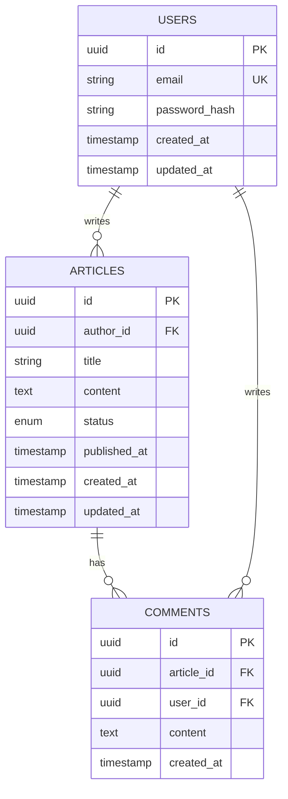

### 5. State Diagrams

System state transitions and workflow states.

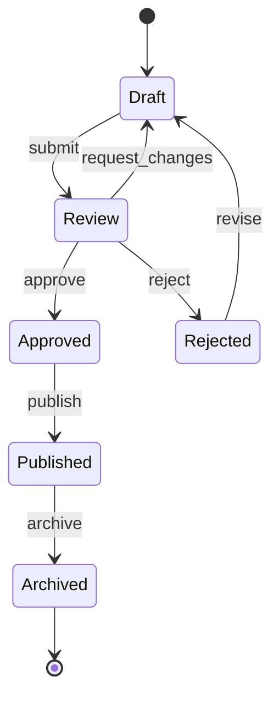

### 6. Git Graphs

Version control branch visualization.

```mermaid
gitgraph
    commit
    commit
    branch feature
    checkout feature
    commit
    commit
    checkout main
    commit
    merge feature
    commit
    branch hotfix
    checkout hotfix
    commit
    checkout main
    merge hotfix
```

### 7. Gantt Charts

Project timelines and development schedules.

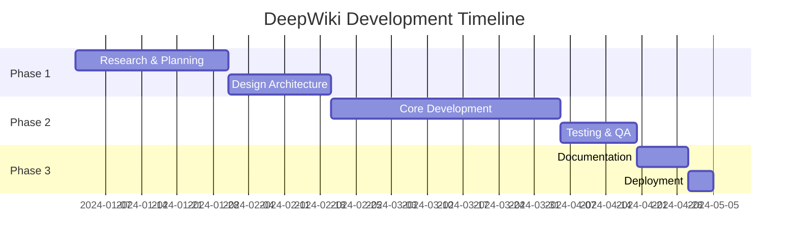

## Automatic Diagram Generation

DeepWiki's AI analyzes your codebase and automatically generates appropriate diagrams:

### Code Analysis Process

1. **File Structure Analysis**: Scans directories, files, and imports
2. **Dependency Mapping**: Identifies relationships between modules
3. **Data Flow Detection**: Traces function calls and data transformations
4. **Pattern Recognition**: Identifies common architectural patterns
5. **Diagram Selection**: Chooses optimal diagram types for each context

### Automatic Generation Features

- **Smart Context Detection**: Different diagrams for different code contexts
- **Relationship Inference**: Automatically detects class inheritance and composition
- **API Flow Mapping**: Generates sequence diagrams from API endpoint analysis
- **Database Schema Extraction**: Creates ERDs from model definitions
- **Workflow Recognition**: Identifies state machines and business processes

## Interactive Features

DeepWiki's Mermaid diagrams are fully interactive:

### Navigation Controls

- **Zoom**: Mouse wheel or pinch gestures
- **Pan**: Click and drag to move around large diagrams
- **Reset**: Double-click to return to original view
- **Full Screen**: Expand diagrams for detailed viewing

### Click Interactions

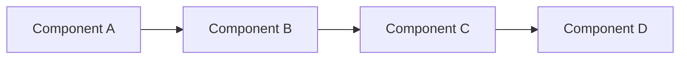

- **Source Code Links**: Click nodes to jump to corresponding code
- **Documentation Links**: Navigate to related documentation sections
- **External Resources**: Link to external APIs, services, or documentation

## Diagram Customization

### Theme Configuration

DeepWiki supports multiple built-in themes and custom styling:

```javascript
// Custom theme configuration
{
  "theme": "dark",
  "themeVariables": {
    "primaryColor": "#ff6b6b",
    "primaryTextColor": "#ffffff",
    "primaryBorderColor": "#ff4757",
    "lineColor": "#70a1ff",
    "sectionBkgColor": "#2f3542",
    "altSectionBkgColor": "#57606f",
    "gridColor": "#3d4454",
    "secondaryColor": "#7bed9f",
    "tertiaryColor": "#5352ed"
  }
}
```

### Style Customization

Apply custom CSS classes to diagram elements:

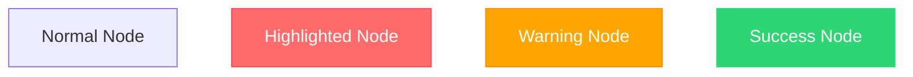

### Advanced Styling Options

- **Custom CSS Classes**: Define reusable styles
- **Node Shapes**: Choose from various shapes (rectangles, circles, diamonds)
- **Edge Styles**: Customize line types (solid, dashed, dotted)
- **Color Schemes**: Brand-specific color palettes
- **Font Customization**: Typography and sizing options

## Troubleshooting Diagram Rendering

### Common Issues and Solutions

#### 1. Diagram Not Rendering

**Symptoms**: Blank space where diagram should appear

**Solutions**:
- Check Mermaid syntax for errors
- Verify JavaScript is enabled in browser
- Clear browser cache and refresh
- Check browser console for error messages

#### 2. Syntax Errors

**Symptoms**: Error messages in diagram area

**Common fixes**:
```mermaid
// ❌ Incorrect
graph TD
    A -> B // Wrong arrow syntax
    
// ✅ Correct  
graph TD
    A --> B
```

#### 3. Performance Issues with Large Diagrams

**Symptoms**: Slow loading or browser freezing

**Solutions**:
- Break large diagrams into smaller sections
- Use subgraphs to organize complex diagrams
- Implement lazy loading for diagram-heavy pages
- Consider static image generation for very complex diagrams

#### 4. Mobile Rendering Issues

**Symptoms**: Diagrams too small or not responsive

**Solutions**:
- Use responsive container sizing
- Implement touch-friendly zoom controls
- Consider simplified mobile versions
- Test on various device sizes

### Debug Mode

Enable debug mode for detailed error information:

```javascript
// Enable Mermaid debug mode
mermaid.initialize({
  startOnLoad: true,
  logLevel: 'debug',
  securityLevel: 'loose'
});
```

## Manual Diagram Editing

### Inline Diagram Creation

Add custom diagrams directly in your documentation:

```markdown
## System Architecture

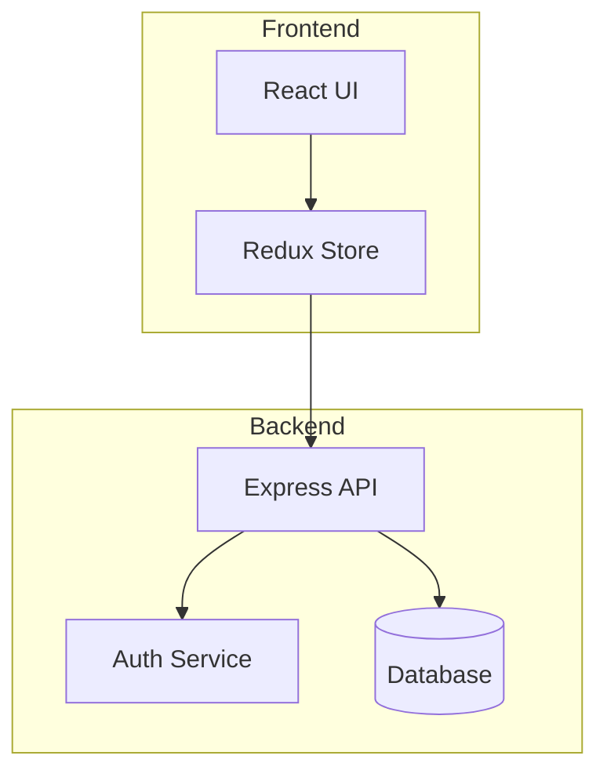
```

### Dynamic Diagram Generation

Use DeepWiki's API to generate diagrams programmatically:

```javascript
// Generate diagram from code analysis
const diagram = await deepwiki.generateDiagram({
  type: 'flowchart',
  source: 'src/components/',
  options: {
    theme: 'dark',
    direction: 'TD'
  }
});
```

### Diagram Templates

Create reusable diagram templates:

```yaml
# diagram-templates.yaml
api_flow:
  type: sequence
  participants:
    - Client
    - API Gateway  
    - Microservice
    - Database
  interactions:
    - Client->API Gateway: Request
    - API Gateway->Microservice: Forward
    - Microservice->Database: Query
    - Database-->Microservice: Result
    - Microservice-->API Gateway: Response
    - API Gateway-->Client: Response
```

## Exporting Diagrams

### SVG Export

Export diagrams as scalable SVG files:

```javascript
// Export current diagram as SVG
const svgData = mermaid.render('diagram-id', diagramDefinition);
const svgBlob = new Blob([svgData], {type: 'image/svg+xml'});
const downloadUrl = URL.createObjectURL(svgBlob);
```

### PNG/JPEG Export

Convert to raster formats for presentations:

```javascript
// Convert SVG to PNG using canvas
const canvas = document.createElement('canvas');
const ctx = canvas.getContext('2d');
const img = new Image();
img.onload = () => {
  canvas.width = img.width;
  canvas.height = img.height;
  ctx.drawImage(img, 0, 0);
  const pngUrl = canvas.toDataURL('image/png');
};
img.src = 'data:image/svg+xml;base64,' + btoa(svgData);
```

### PDF Integration

Include diagrams in PDF documentation:

```javascript
// Generate PDF with embedded diagrams
const pdf = new jsPDF();
const diagramSvg = await mermaid.render('diagram', definition);
pdf.addSVG(diagramSvg, 10, 10, 190, 100);
pdf.save('documentation.pdf');
```

## Best Practices for Diagram-Heavy Documentation

### 1. Strategic Diagram Placement

- **Overview First**: Start with high-level architecture diagrams
- **Progressive Detail**: Follow with detailed component diagrams
- **Context Switching**: Use diagrams to transition between topics
- **Reference Points**: Include diagrams as visual anchors

### 2. Diagram Organization

```markdown
## Architecture Overview
<!-- High-level system diagram -->

### Frontend Architecture  
<!-- Frontend-specific diagrams -->

### Backend Services
<!-- Backend service diagrams -->

### Data Flow
<!-- Sequence diagrams showing data flow -->

### Database Schema
<!-- ERD diagrams -->
```

### 3. Accessibility Considerations

- **Alt Text**: Provide descriptive text alternatives
- **High Contrast**: Ensure sufficient color contrast
- **Keyboard Navigation**: Support keyboard-only users
- **Screen Reader Support**: Include semantic markup

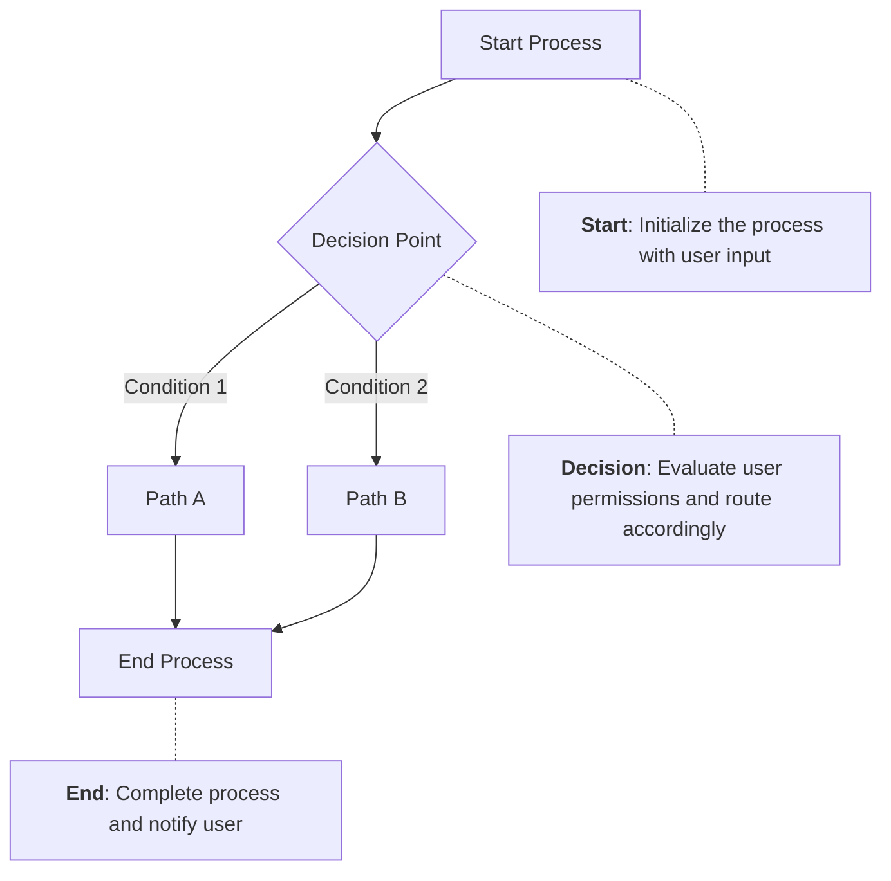

### 4. Performance Optimization

- **Lazy Loading**: Load diagrams on demand
- **Caching**: Cache generated diagrams
- **Compression**: Optimize SVG output
- **Progressive Enhancement**: Provide fallback text descriptions

### 5. Version Control Best Practices

- **Atomic Commits**: Include diagram updates with related code changes
- **Meaningful Names**: Use descriptive diagram IDs and titles  
- **Documentation**: Comment complex diagram definitions
- **Review Process**: Include diagrams in code review workflows

## Advanced Examples

### Complex System Architecture

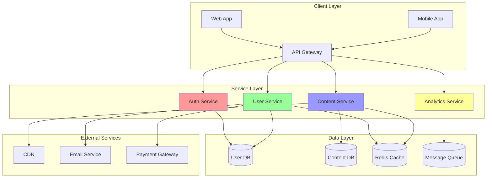

### Database Relationship Diagram

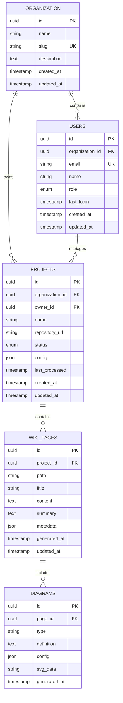

### API Interaction Flow

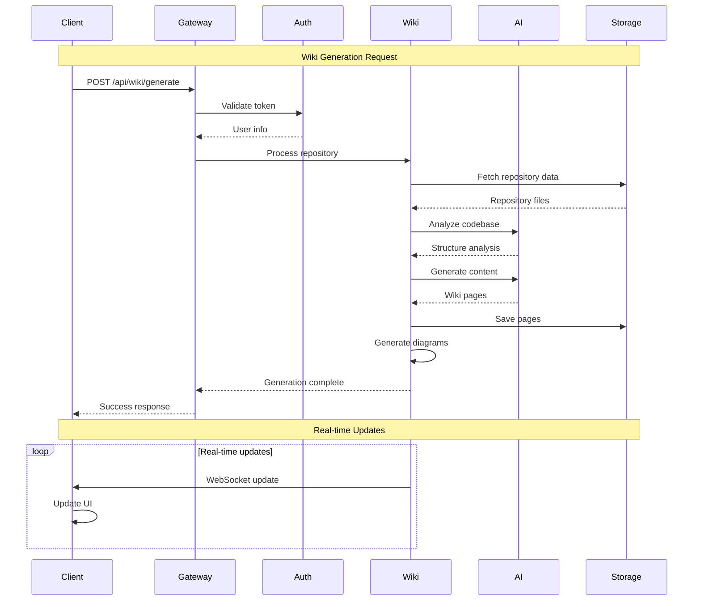

## Conclusion

Mermaid diagrams in DeepWiki provide a powerful way to visualize and communicate complex software architectures, processes, and relationships. By leveraging automatic generation, interactive features, and extensive customization options, you can create documentation that is both informative and engaging.

Remember to:
- Use appropriate diagram types for different contexts
- Optimize for performance with large documentation sites
- Consider accessibility in diagram design
- Maintain diagrams as living documentation alongside your code
- Leverage automation while retaining the flexibility for manual customization

With these tools and techniques, you can create documentation that truly brings your codebase to life through visual storytelling.