# Architecture Overview

DeepWiki is a modern AI-powered documentation generation system built with a scalable microservices architecture. This document provides a comprehensive overview of the system's architecture, components, and design decisions.

## High-Level System Architecture

<div className="mermaid">
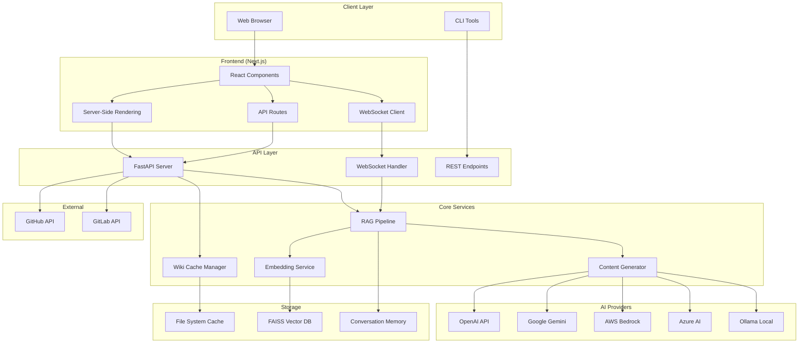
</div>

## Frontend Architecture

The frontend is built with Next.js 14, leveraging modern React patterns and TypeScript for type safety.

### Component Structure

<div className="mermaid">
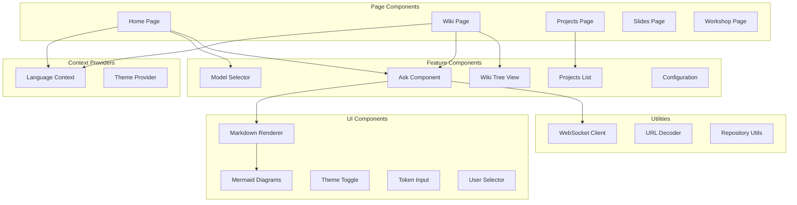
</div>

### Key Frontend Features

1. **Server-Side Rendering (SSR)**
   - Pre-renders pages for better SEO and initial load performance
   - Dynamic route generation for repository pages

2. **Real-time Communication**
   - WebSocket connection for streaming chat responses
   - Progressive content rendering

3. **Internationalization (i18n)**
   - Support for 10+ languages
   - Context-based language switching

4. **Responsive Design**
   - Mobile-first approach
   - Adaptive layouts for different screen sizes

## Backend Architecture

The backend is built with FastAPI, providing high-performance async capabilities and automatic API documentation.

### API Structure

<div className="mermaid">
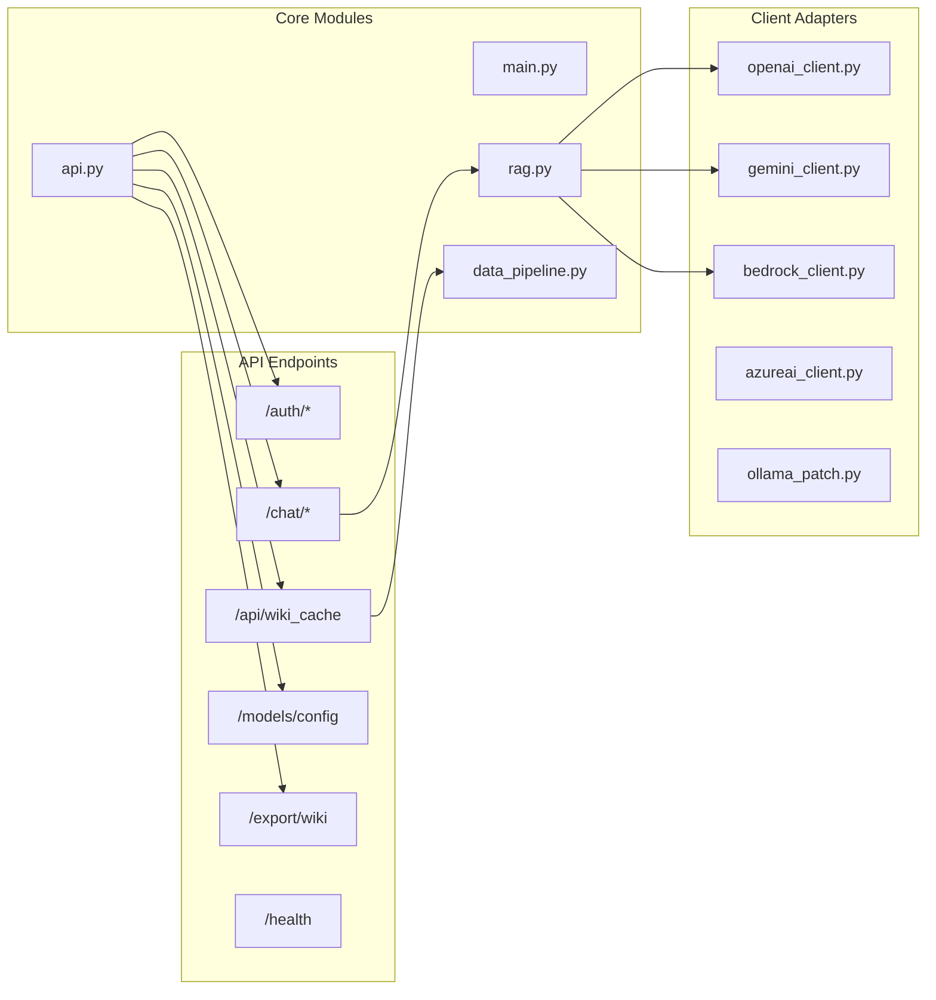
</div>

### RAG Pipeline Architecture

The Retrieval-Augmented Generation (RAG) pipeline is the core of DeepWiki's intelligence.

<div className="mermaid">
```mermaid
graph TB
    subgraph "RAG Pipeline"
        Input[User Query]
        
        subgraph "Retrieval Phase"
            Embedder[Text Embedder]
            VectorSearch[FAISS Vector Search]
            ContextRetrieval[Context Retrieval]
        end
        
        subgraph "Augmentation Phase"
            ContextProcessor[Context Processor]
            MemoryIntegration[Memory Integration]
            PromptBuilder[Prompt Builder]
        end
        
        subgraph "Generation Phase"
            ModelSelector[Model Selector]
            Generator[Content Generator]
            StreamProcessor[Stream Processor]
        end
        
        Output[Generated Response]
    end
    
    Input --> Embedder
    Embedder --> VectorSearch
    VectorSearch --> ContextRetrieval
    ContextRetrieval --> ContextProcessor
    ContextProcessor --> MemoryIntegration
    MemoryIntegration --> PromptBuilder
    PromptBuilder --> ModelSelector
    ModelSelector --> Generator
    Generator --> StreamProcessor
    StreamProcessor --> Output
```
</div>

## Data Flow

### Wiki Generation Flow

<div className="mermaid">
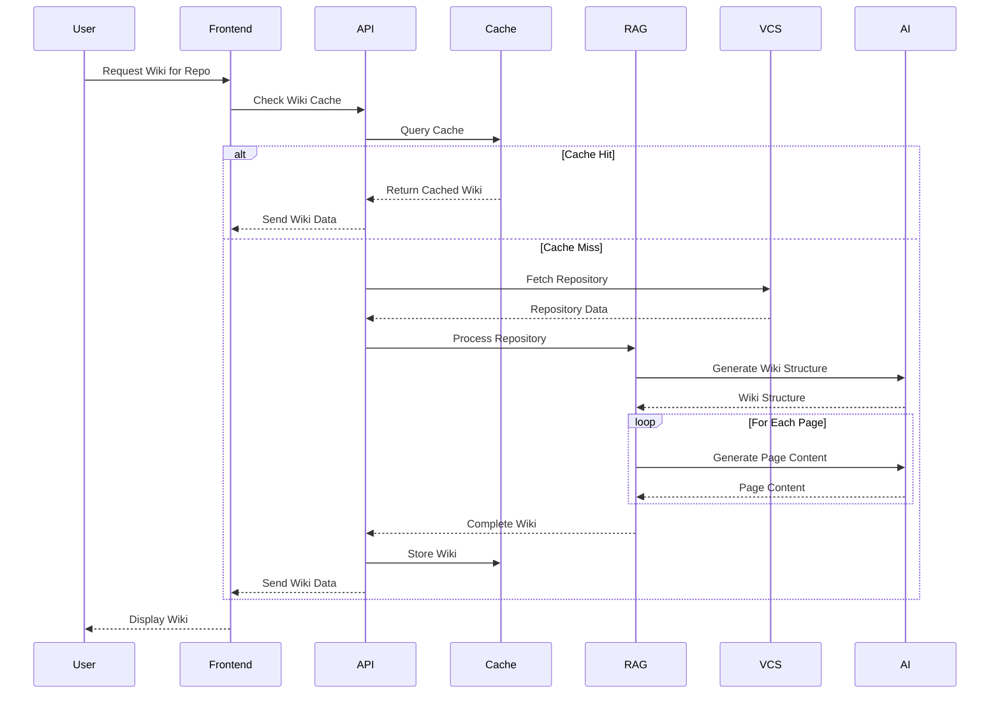
</div>

### Real-time Chat Flow

<div className="mermaid">
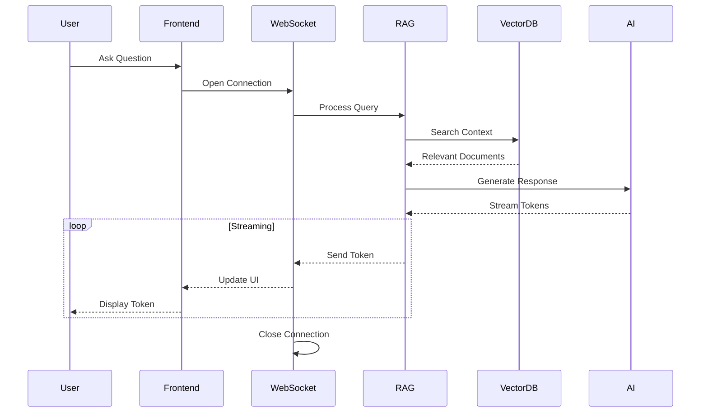
</div>

## Component Interactions

### Core Service Dependencies

<div className="mermaid">
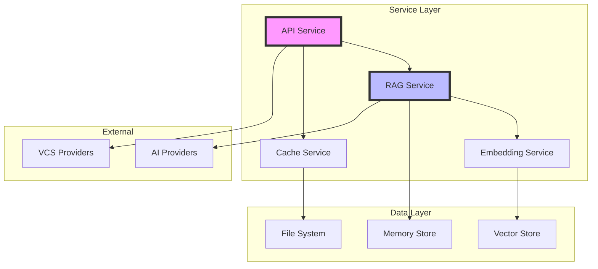
</div>

## Database and Storage Design

### Storage Architecture

<div className="mermaid">
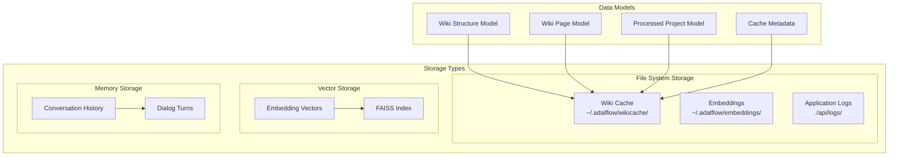
</div>

### Cache Key Structure

```
deepwiki_cache_{repo_type}_{owner}_{repo}_{language}.json

Example:
deepwiki_cache_github_microsoft_vscode_en.json
```

## Caching Strategies

### Multi-Level Caching

1. **Wiki Cache (Persistent)**
   - Full wiki structures stored as JSON
   - Language-specific caching
   - File-based for durability

2. **Vector Cache (In-Memory)**
   - FAISS indices for fast retrieval
   - Rebuilt on startup from embeddings

3. **Conversation Cache (Session)**
   - Dialog history per session
   - Memory-efficient circular buffer

### Cache Invalidation

<div className="mermaid">
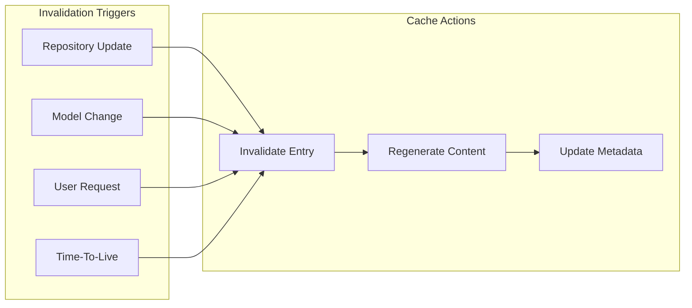
</div>

## Security Architecture

### Authentication & Authorization

<div className="mermaid">
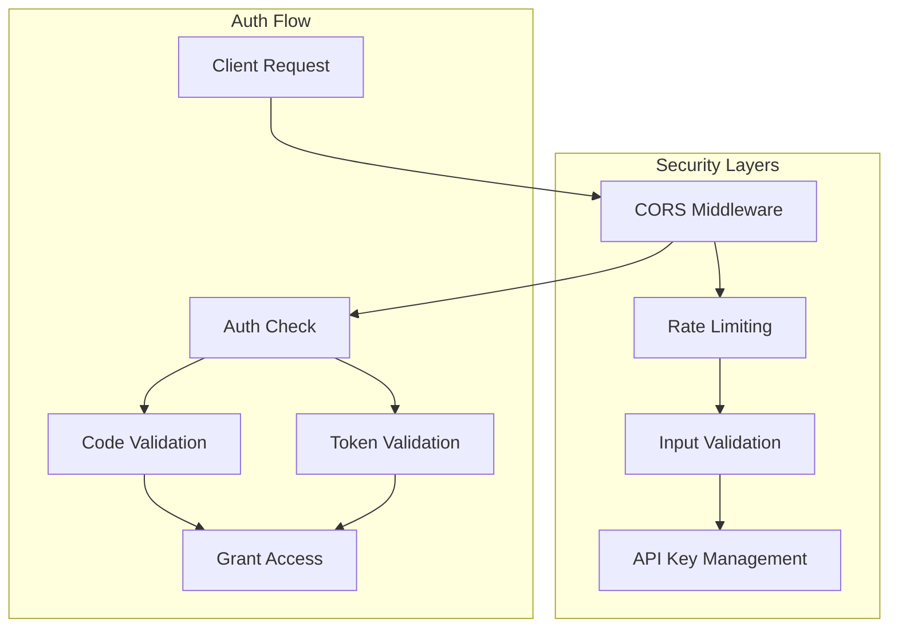
</div>

### Security Features

1. **API Security**
   - CORS configuration for cross-origin requests
   - Environment-based API key management
   - Input validation and sanitization

2. **Data Protection**
   - Token-based repository access
   - Secure storage of credentials
   - Encrypted communication channels

3. **Rate Limiting**
   - Request throttling per IP
   - WebSocket connection limits
   - Resource usage monitoring

## Scalability Considerations

### Horizontal Scaling

<div className="mermaid">
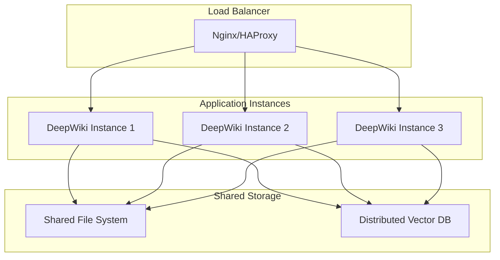
</div>

### Performance Optimizations

1. **Async Processing**
   - Non-blocking I/O operations
   - Concurrent request handling
   - Stream processing for large responses

2. **Resource Management**
   - Memory limits (6GB max, 2GB reserved)
   - Connection pooling
   - Garbage collection optimization

3. **Caching Strategy**
   - Pre-computed wiki structures
   - Embedding reuse
   - Response streaming

## Centralized Prompt Management

As of commit 36777d3, DeepWiki implements a centralized prompt management system for better maintainability and consistency across the application.

### Prompt Architecture

<div className="mermaid">
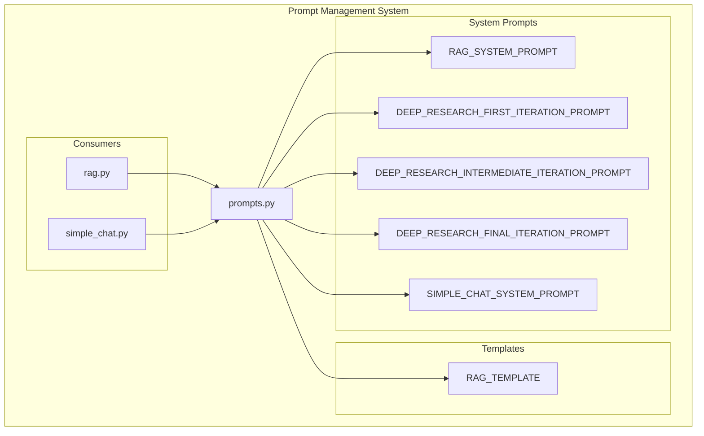
</div>

### Prompt Types and Usage

#### 1. RAG System Prompt
- **Purpose**: Core prompt for RAG-based question answering
- **Features**:
  - Language detection and response matching
  - Markdown formatting guidelines
  - Context integration with past conversations
  - Code syntax highlighting support

#### 2. Deep Research Prompts
Three-stage research prompt system for comprehensive analysis:

- **First Iteration**: Research planning and initial investigation
- **Intermediate Iterations**: Building on previous findings
- **Final Iteration**: Synthesis and comprehensive conclusion

#### 3. Simple Chat System Prompt
- **Purpose**: Direct, concise responses without preambles
- **Features**:
  - No markdown headers in responses
  - Direct answers without filler
  - Optimized for quick interactions

### Benefits of Centralized Management

1. **Consistency**: All prompts follow the same standards and formatting
2. **Maintainability**: Single source of truth for all prompt templates
3. **Versioning**: Easy to track prompt changes and iterations
4. **Testability**: Prompts can be unit tested and validated
5. **Flexibility**: Easy to add new prompts or modify existing ones

### Implementation Example

```python
# api/prompts.py
"""Module containing all prompts used in the DeepWiki project."""

# Centralized prompt definitions
RAG_SYSTEM_PROMPT = r"""
You are a code assistant which answers user questions on a Github Repo.
You will receive user query, relevant context, and past conversation history.

LANGUAGE DETECTION AND RESPONSE:
- Detect the language of the user's query
- Respond in the SAME language as the user's query
...
"""

# Usage in rag.py
from api.prompts import RAG_SYSTEM_PROMPT, RAG_TEMPLATE

def create_rag_prompt(query, contexts, history):
    return RAG_TEMPLATE.format(
        system_prompt=RAG_SYSTEM_PROMPT,
        input_str=query,
        contexts=contexts,
        conversation_history=history
    )
```

## Technology Stack

### Frontend Technologies

| Category | Technology | Purpose |
|----------|------------|---------|
| Framework | Next.js 14 | React framework with SSR |
| Language | TypeScript | Type safety |
| Styling | Tailwind CSS | Utility-first CSS |
| UI Library | Radix UI | Accessible components |
| State | React Context | Global state management |
| HTTP | Fetch API | REST communication |
| WebSocket | Native WebSocket | Real-time communication |
| Markdown | react-markdown | Content rendering |
| Diagrams | Mermaid | Flowchart rendering |

### Backend Technologies

| Category | Technology | Purpose |
|----------|------------|---------|
| Framework | FastAPI | High-performance API |
| Language | Python 3.11+ | Backend development |
| Server | Uvicorn | ASGI server |
| Vector DB | FAISS | Similarity search |
| ML Framework | AdalFlow | RAG implementation |
| Logging | Python logging | Application logs |
| Environment | python-dotenv | Configuration |

### AI/ML Stack

| Category | Technology | Purpose |
|----------|------------|---------|
| Embeddings | OpenAI/Gemini | Text embeddings |
| Generation | Multiple LLMs | Content generation |
| RAG | AdalFlow | Retrieval augmentation |
| Vector Search | FAISS | Semantic search |

### Infrastructure

| Category | Technology | Purpose |
|----------|------------|---------|
| Container | Docker | Application packaging |
| Orchestration | Docker Compose | Service management |
| Storage | File System | Persistent storage |
| Process Mgmt | Supervisor | Process control |

## Deployment Architecture

<div className="mermaid">
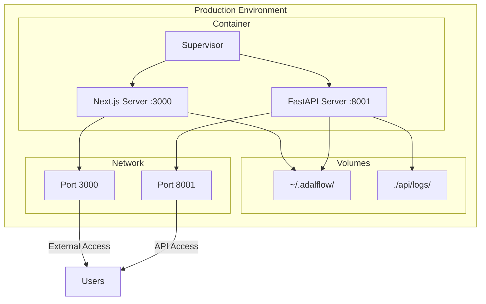
</div>

## Best Practices & Design Principles

### Architecture Principles

1. **Separation of Concerns**
   - Clear boundaries between frontend and backend
   - Modular service design
   - Independent scaling capabilities

2. **Resilience**
   - Graceful error handling
   - Fallback mechanisms
   - Health monitoring

3. **Performance**
   - Async-first design
   - Efficient caching
   - Resource optimization

4. **Maintainability**
   - Clean code architecture
   - Comprehensive logging
   - Type safety throughout

### Development Guidelines

1. **Code Organization**
   - Feature-based module structure
   - Consistent naming conventions
   - Separation of business logic

2. **Testing Strategy**
   - Unit tests for core logic
   - Integration tests for APIs
   - End-to-end testing for critical flows

3. **Documentation**
   - Inline code documentation
   - API documentation (OpenAPI)
   - Architecture decision records

## Future Enhancements

### Planned Improvements

1. **Scalability**
   - Kubernetes deployment support
   - Distributed caching with Redis
   - Message queue integration

2. **Features**
   - Real-time collaboration
   - Advanced analytics
   - Plugin system

3. **Performance**
   - GraphQL API option
   - Edge caching
   - Optimized vector search

### Architecture Evolution

The architecture is designed to evolve with:
- Microservices decomposition
- Event-driven architecture
- Serverless function support
- Multi-region deployment

## Conclusion

DeepWiki's architecture balances performance, scalability, and maintainability while providing a robust platform for AI-powered documentation generation. The modular design allows for easy extension and adaptation to changing requirements.